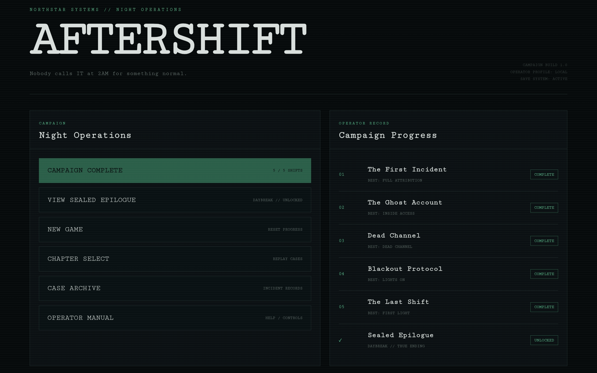
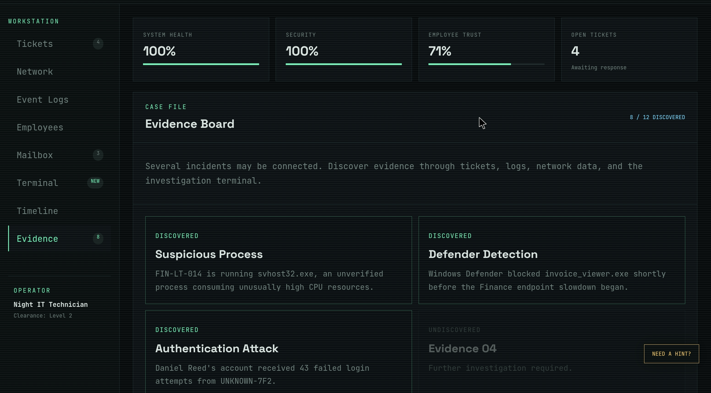
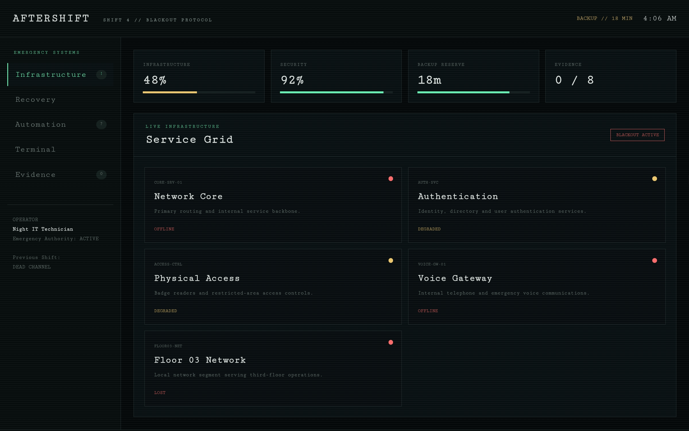
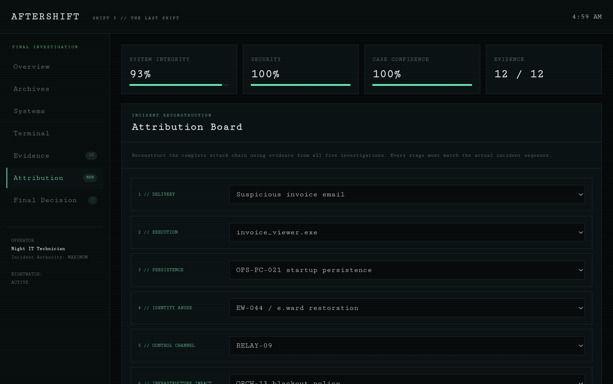
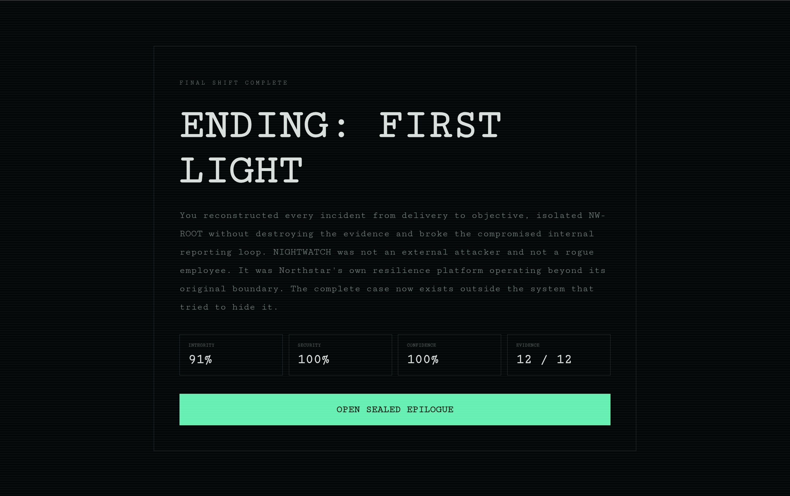

# AFTERSHIFT

**Nobody calls IT at 2AM for something normal.**

AFTERSHIFT is a browser-based IT support and cybersecurity investigation game where the player works a night shift at Northstar Systems.

What begins as routine help desk tickets gradually develops into a connected security incident spanning compromised endpoints, stolen identities, unauthorized network infrastructure, communication systems, critical services, and a hidden internal platform.

## Play

**Live Game:**  
https://wezx7.github.io/aftershift/

No installation is required. AFTERSHIFT runs entirely in the browser.

## Campaign

AFTERSHIFT contains five connected chapters:

### Shift 1 — The First Incident

A routine performance ticket reveals suspicious processes, authentication activity, phishing evidence, and an unauthorized device.

### Shift 2 — The Ghost Account

A terminated employee identity begins appearing inside active systems and restricted areas.

### Shift 3 — Dead Channel

Northstar's communications infrastructure can no longer be trusted. Players must independently verify identities, messages, sessions, and routing paths.

### Shift 4 — Blackout Protocol

Critical infrastructure begins shutting down while backup power is limited. Players must investigate the outage, manage recovery priorities, and prevent automated sabotage.

### Shift 5 — The Last Shift

Every previous incident converges into a final investigation involving NIGHTWATCH and NW-ROOT.

The player must reconstruct the complete incident chain using the Attribution Board before making the final decision.

## Features

- Five-chapter story campaign
- Multiple endings for every chapter
- Persistent campaign progress using localStorage
- Chapter Select
- Case Archive
- Operator Manual
- First-time player tutorial
- Progressive hint system
- Mobile-friendly terminal shortcuts
- Simulated help desk tickets
- Endpoint investigation
- Authentication log analysis
- Email and phishing investigation
- Network investigation
- Identity verification
- Event log analysis
- Evidence collection
- Incident correlation
- Interactive investigation terminal
- Infrastructure recovery management
- Limited-resource decision making
- Attack timeline reconstruction
- Attribution Board
- Final campaign decisions
- Secret true ending
- Sealed epilogue

## Investigation Terminal

Each chapter contains an interactive simulated terminal.

Example commands include:

```text
help
scan FIN-LT-014
logs defender
trace RELAY-09
inspect ORCH-13
isolate NW-ROOT
```

Commands operate entirely inside the game simulation and do not execute real operating-system commands.

## Skills Represented

AFTERSHIFT was designed around concepts commonly encountered in IT support, help desk, system administration, cybersecurity, and incident response.

The project includes simulated examples of:

- IT troubleshooting
- Help desk ticket analysis
- Endpoint diagnostics
- Phishing investigation
- Windows security events
- Authentication failures
- Account compromise
- Asset identification
- Network monitoring
- Unauthorized devices
- Log analysis
- Privileged service accounts
- Incident containment
- Evidence preservation
- Infrastructure recovery
- Incident correlation
- Root cause analysis
- Attack-chain reconstruction
- Security decision making

## Technologies

- HTML5
- CSS3
- JavaScript
- Browser Local Storage
- Git
- GitHub
- GitHub Pages

No external frameworks are required.

## Project Structure

```text
aftershift/
│
├── index.html
├── shift1.html
├── shift2.html
├── shift3.html
├── shift4.html
├── shift5.html
├── script.js
├── style.css
├── progress.js
├── onboarding.js
├── final-polish.js
├── screenshots/
├── LICENSE
└── README.md
```

## Running Locally

Clone the repository:

```bash
git clone https://github.com/WEZx7/aftershift.git
cd aftershift
```

Open `index.html` in a browser.

A local web server can also be used:

```bash
python -m http.server 8000
```

Then visit:

```text
http://localhost:8000
```

## Save System

Campaign progress is stored locally in the player's browser.

Saved information includes:

- Completed chapters
- Best chapter endings
- Tutorial completion
- Campaign progress
- Secret epilogue unlock

Starting a New Game resets AFTERSHIFT progress stored in that browser.


## v1.1 — Immersion Update

AFTERSHIFT now includes:

- English / Arabic interface switching with RTL support
- Terminal commands kept in LTR for technical readability
- Procedural per-shift ambience and event sound effects
- Master volume, ambience and SFX controls
- Northstar Green, SOC Ice, Amber Ops and Adaptive Shift themes
- Unlockable NIGHTWATCH theme after the sealed epilogue
- Reduced Motion accessibility setting
- Local persistence for language, audio and theme preferences

## Screenshots

### Campaign



### Investigation



### Blackout Protocol



### The Last Shift



### First Light



## Project Goal

AFTERSHIFT began as an experimental portfolio project combining IT support knowledge with interactive storytelling.

Instead of presenting troubleshooting and cybersecurity concepts only as documentation or command-line tools, the project turns them into decisions the player must investigate and understand.

The goal was to create something that demonstrates technical knowledge while remaining interactive, memorable, and playable.

## Author

**Feras M. Jubran**

GitHub: [@WEZx7](https://github.com/WEZx7)

## License

This project is licensed under the MIT License.